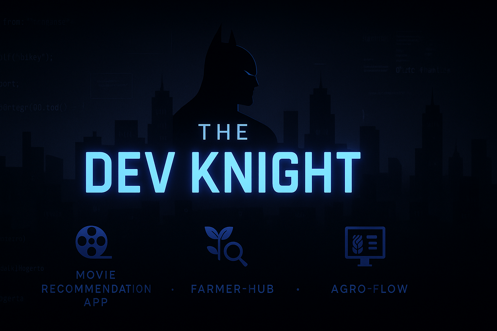

# 🦇 Chima Ben — The Dev Knight

> Full-stack developer crafting elegant, performant web solutions,
> With the precision of a coder and the discipline of a vigilante.

  

---

### 💼 About Me

I’m a developer who believes clean code and good design should go hand-in-hand. I specialize in building scalable applications, automating workflows, and turning business ideas into powerful digital products.

- 💻 JavaScript | React | Node.js | MongoDB | SQL | Figma
- ✨ Currently building: [Farmers Hub](https://github.com/benmarcel/Farmers-Hub.git) — Farm product price tracker & support platform
- 🎯 Learning: Ux/Ui design, with Figma 

---

### ⚙️ Tech Stack

---

### 🚀 Featured Projects

🔹 **[Movie Recommendation App](https://movierecc.netlify.app/)**  
*A movie recommendation app where users can search (3mtt capestone project) *  
`React · Mongo-db · PWA · Node.js . Express.js .`

🔹 **[Agro Flow](https://benmarcel.github.io/agro_flow_project/)**  
*A a sorage booking and logistic plartform for farmers*  
`Html · Tailwind css ·  javaScript `

🔹 **[Gozie Telemed](https://github.com/benmarcel/Plp-final_project.git)**  
*24/7 Telemedicine platform for African communities (Practice project)*  
`Html . Css . Node.js .Express.js. MySql `

---

### 🧩 Dev Knight Logs

- 🎥 Sharing dev stories & code content as **@TheDevKnight** on [Twitter (X)](https://x.com/TheDev_Knight?t=plgKzWGsITg8SMXtMxjvjQ&s=09)
- 🧠 Documenting my journey with humor, dark-mode builds & daily tips

---

### 📫 Let's Connect

- 🌐 [Portfolio](#) 
- 💼 [LinkedIn](https://www.linkedin.com/in/chima-ben?utm_source=share&utm_campaign=share_via&utm_content=profile&utm_medium=android_app)
- 📱💬 [WhatsApp](https://wa.me/2348023678500)  
- 💬 DM-friendly on [X (Twitter)](https://x.com/TheDev_Knight?t=plgKzWGsITg8SMXtMxjvjQ&s=09)

---

> “I build in silence. I debug in the shadows.  
> But I deliver with light-speed precision.”  
> — The Dev Knight

